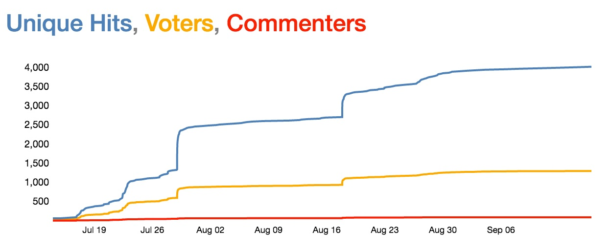
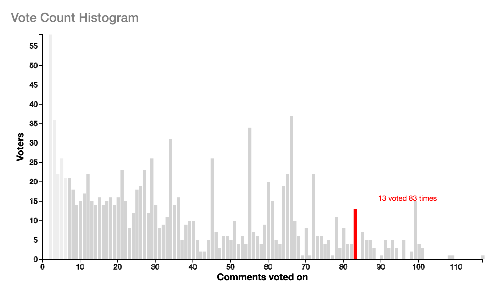
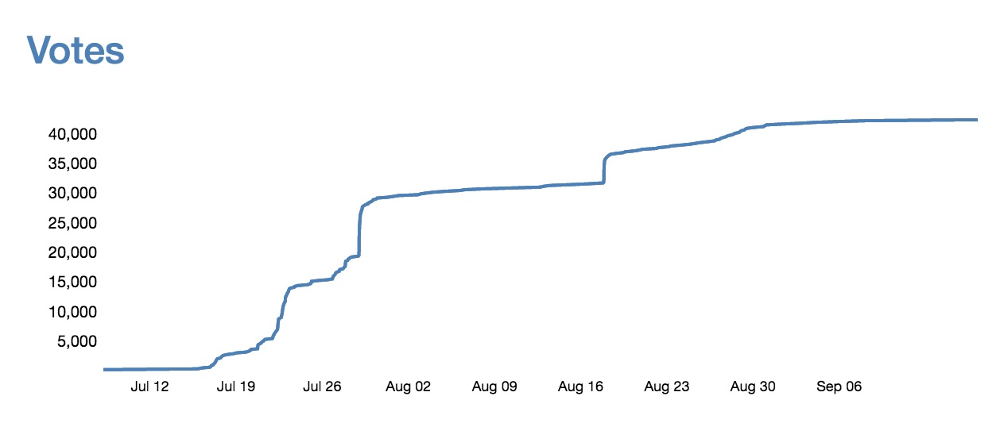
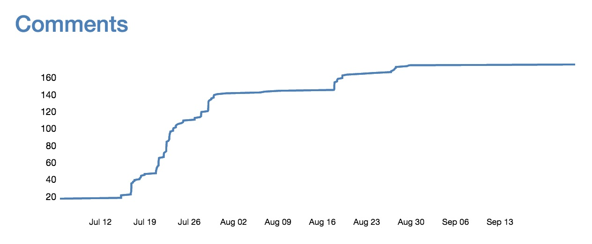

# Conversation Analytics

The graphs below are from a real polis conversation and illustrate an important point. Polis engages [lurkers](https://en.wikipedia.org/wiki/Lurker) - users who don't engage if their sole option is to write a comment.

## Number of unique hits, voters, and comment authors over time
------------
This graph shows participation rates across three segments:

* Users who loaded the page
* Users who wrote and submitted a comment
* Users who clicked agree and disagree at least once

~1% of users commented. ~25% of users voted.

## Votes per participant
--------------------
The graph above begs a question: of those who voted, how much did they vote? The next graph gives us insight in to that. People vote a lot!

The light gray bars denote users who voted less than 7 times. These users are not included in the statistical computation or the visualization, because of a lack of data for them.

## Number of votes over time
------------------

How many votes were cast, and when?

## Comments over time
------------
How does that compare to the number of comments submitted? In this conversation, there were ~250x more votes than comments!

